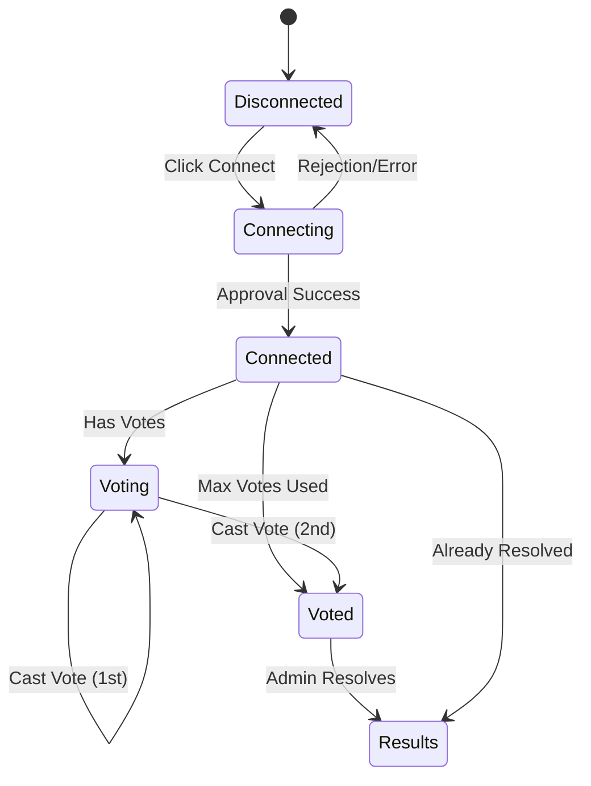
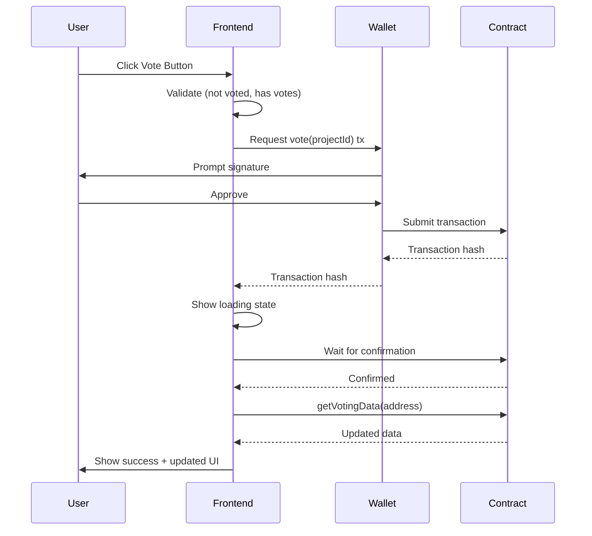
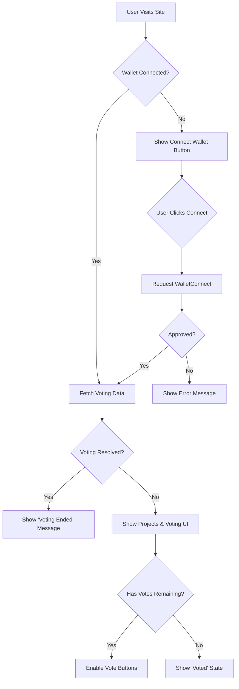

# Hackathon Voting Platform - Frontend Technical Specification

## 1. Background

### Problem Statement
Hackathon participants and judges need a transparent, user-friendly interface to browse projects, cast votes, and view results. The current lack of a frontend makes the blockchain-based voting system inaccessible to non-technical users who cannot interact directly with smart contracts.

### Context / History
- Smart contract system deployed on Gnosis Chain (mainnet) and Holesky (testnet)
- Contract interface: `HackathonVoting.sol` with voting and results functions
- Each wallet can vote for up to 2 different projects
- Voting is transparent and immutable on-chain
- Admin functions (project registration, voting resolution) handled via Forge scripts (not frontend)
- Categories are flexible strings (e.g., "AI", "Web3", "IoT", "Other")

### Stakeholders
- **Voters**: Hackathon participants, judges, and community members with wallet addresses
- **Project Teams**: Teams whose projects are displayed and voted upon
- **Smart Contract**: HackathonVoting contract on Gnosis Chain/Holesky
- **Admins**: Hackathon organizers who use Forge scripts to manage projects and voting (out of scope for frontend)

## 2. Motivation

### Goals & Success Stories

**User Goals:**
1. **Voter Journey**: "As a voter, I can browse all hackathon projects, view details, cast up to 2 votes, and see my voting history without needing to understand blockchain"
2. **Results Transparency**: "As a participant, I can see vote counts and final results immediately after voting closes"
3. **Wallet Connection**: "As a user, I can connect my wallet seamlessly and the app shows me my personalized voting state"

**Technical Functionality:**
- Wallet integration with connection/disconnection flow
- Blockchain data fetching and display using view functions
- Responsive UI for mobile and desktop
- Transaction status feedback with loading and error states

## 3. Scope and Approaches

### Non-Goals

| Technical Functionality | Reasoning for being off scope | Tradeoffs |
|------------------------|------------------------------|-----------|
| User authentication (email/password) | Blockchain wallets provide identity | Users must have a Web3 wallet |
| Admin panel/dashboard | Admins use Forge scripts directly | No UI complexity, requires CLI knowledge |
| Project registration UI | Projects registered via Forge scripts | Reduces spam, requires admin technical knowledge |
| Voting resolution UI | Admin resolves via Forge scripts | Simpler frontend, requires CLI access |
| Vote editing/deletion | Votes are immutable on-chain | Simpler contract, no vote changes |
| Multi-network support | Deployed only to Gnosis & Holesky | Simpler deployment, less flexibility |
| Mobile app (native) | Web-first approach | Accessible via mobile browsers |

### Value Proposition

| Technical Functionality | Value | Tradeoffs |
|------------------------|-------|-----------|
| Wallet connection | Seamless Web3 identity, no signup | Requires wallet installation |
| View-based data fetching | Simple, efficient data loading | Manual refresh needed for updates |
| Single-page application | Instant navigation, smooth UX | Larger initial load |
| Responsive design | Works on all devices | More CSS complexity |
| Error handling | Clear user feedback | More UI states to manage |

### Alternative Approaches

| Technical Functionality | Pros | Cons |
|------------------------|------|------|
| Server-side rendering | Better SEO, faster first paint | More complex deployment |
| Centralized API backend | Caching, lower RPC costs | Centralization, server costs |
| Multi-wallet support | More user choice | Complex integration |
| Auto-refresh/polling | Automatic data updates | Wasted RPC calls, battery drain |
| Event subscriptions | Real-time updates | Infrastructure complexity, not needed |

### Relevant Metrics
- Wallet connection success rate
- Transaction completion rate
- Page load time (data fetch from contract)
- Vote submission success rate

## 4. Step-by-Step Flow

### 4.1 Main ("Happy") Paths

#### Flow 1: Voter Views and Casts Vote

**Pre-condition:** Voting is active, wallet is connected

1. **User** visits voting platform homepage
2. **System** prompts wallet connection if not connected
3. **User** clicks "Connect Wallet" button
4. **System** requests wallet connection via Web3 provider
5. **Wallet** prompts user for approval
6. **User** approves connection
7. **System** fetches `getVotingData(userAddress)` from contract
8. **System** displays:
   - All projects with details (title, description, team, category, votes)
   - User's remaining votes (2 - voterProjectIds.length)
   - Total vote count and voter count
9. **User** browses projects, clicks "Vote" on a project card
10. **System** validates: user hasn't voted for this project, has votes remaining
11. **System** calls `vote(projectId)` contract function
12. **Wallet** prompts user to sign transaction
13. **User** approves transaction
14. **System** shows loading state with transaction hash
15. **System** waits for transaction confirmation
16. **System** emits success notification
17. **System** refetches `getVotingData(userAddress)` to update UI
18. **System** displays updated vote counts and user's voting state
19. **User** can vote for one more project (if first vote) or manually refresh to see latest state

**Post-condition:** User has voted, UI reflects updated state, transaction recorded on-chain

### 4.2 Alternate / Error Paths

| # | Condition | System Action | Suggested Handling |
|---|-----------|---------------|-------------------|
| A1 | Wallet not installed | Detect no Web3 provider | Show WalletConnect QR code/deep links for mobile wallets |
| A2 | Wallet connection rejected | User denies connection | Show "Connection required to vote" message with retry button |
| A3 | Wrong network | Connected to non-Gnosis/Holesky | Show network switch prompt with instructions |
| A4 | Transaction rejected | User denies signature | Show "Transaction cancelled" notification, keep UI state |
| A5 | Already voted for project | `AlreadyVotedForProject` error | Show "You already voted for this project" message |
| A6 | Max votes reached | `MaxVotesReached` error | Show "You've used both votes" message, hide vote buttons |
| A7 | Voting already resolved | `VotingAlreadyResolved` error | Show "Voting has ended" message |
| A8 | Project not found | `ProjectNotFound` error | Show 404 project page, link to home |
| A9 | Transaction failed | RPC error, network timeout | Show error message with transaction hash, retry button |
| A10 | No projects registered | `projectCount = 0` | Show "No projects yet" empty state |
| A11 | No votes cast | `totalVoters = 0` | Show "Be the first to vote!" message |
| A12 | Disconnected wallet | Wallet disconnects mid-session | Detect disconnection, prompt reconnection |
| A13 | Insufficient gas | Transaction fails for gas | Show gas error message, suggest increasing gas |

## 5. Components and User Flows

### 5.1 Core Components

#### Layout Components
1. **Header**
   - Logo/Brand
   - Wallet connection button
   - Network indicator (Gnosis/Holesky)
   - Navigation (Home, Projects)
   - User info (address, votes remaining)

2. **Footer**
   - Links (GitHub, Documentation)
   - Contract addresses
   - Network info

#### Page Components

3. **Home Page**
   - Hero section with event info
   - Statistics cards (total projects, total votes, total voters)
   - Call-to-action (Connect Wallet, View Projects)
   - Voting status indicator (Active/Closed)

4. **Projects Page**
   - Filter/Search bar (by category, team name)
   - Sort options (most votes, newest, alphabetical)
   - Project grid/list view toggle
   - Project cards array

5. **Project Card Component**
   - Project image
   - Title and team name
   - Category badge
   - Description (truncated with "read more")
   - Vote count with icon
   - Demo and GitHub links
   - Vote button (if voting active and eligible)
   - "Voted" indicator (if user voted)

6. **Project Detail Modal/Page**
   - Full project information
   - All media/links
   - Vote count and voting users (if public)
   - Vote button
   - Social share buttons

#### Utility Components

7. **Wallet Connection Modal**
   - WalletConnect integration (preferred wallet solution)
   - Connection status
   - Error messages
   - Tutorial/help link

8. **Transaction Status Modal**
   - Loading spinner
   - Transaction hash link to explorer
   - Success/error state
   - Action buttons (Close, View on Explorer)

9. **Error Boundary**
   - Catch application errors
   - Show user-friendly error page
   - Reload/retry options

10. **Toast/Notification System**
    - Success messages
    - Error messages
    - Info messages
    - Transaction updates

11. **Loading States**
    - Skeleton loaders for project cards
    - Spinner for transactions
    - Progress indicators

12. **Empty States**
    - No projects registered
    - No votes cast
    - Search no results

### 5.2 User Flow Diagram

