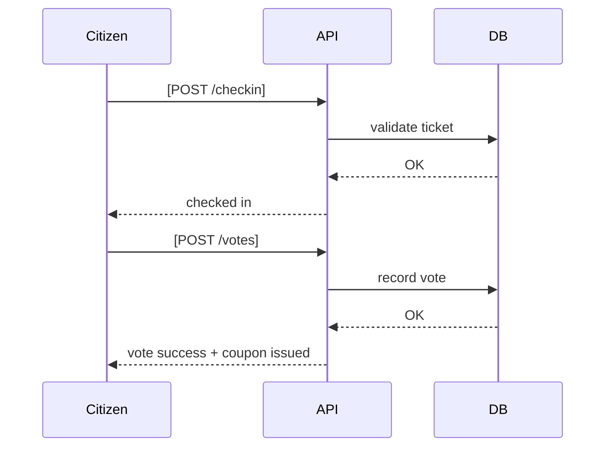

# Technical Spec

## 1. Background

### Problem Statement:
There is no simple way for local citizens to vote on social issue–related projects, and no structured process for hackers to submit their projects to be evaluated by citizens.

### Context / History:
Built for Hackatsuon 2025 as an MVP.

Existing voting platforms exist, but few integrate QR check-in → live vote tally → coupon issuance in one flow.

Inspired by early experiments in KeseBridge (public finance MVP).

### Stakeholders:
- Hackers (project submitters)
- Citizens (voters)
- Organizers (admins, jury)
- External systems (coupon providers, optional on-chain recording)

## 2. Motivation

### Goals & Success Stories:
- Hackers can submit their projects before voting.
- Citizens can check in with a QR code and cast one unique vote.
- Voting results are updated live and displayed in real time.
- Citizens receive a coupon after voting, adding tangible value.
- Demonstrates civic-tech use cases where citizens directly interact with local challenges.

## 3. Scope and Approaches

### Non-Goals:
- Legally binding election system.
- High-traffic readiness (MVP assumes up to a few hundred users).
- Full anonymity (uniqueness enforced via ticket, not cryptography).

### Reasoning for being off scope:
- Hackathon MVP—implementation cost and complexity must be minimized.
- Designed for a single live event, not nationwide deployment.

### Tradeoffs:
- Rate limiting: Low expected usage, but spam protection needed.
- Duplicate vote prevention is ticket-based (simple, not cryptographically strong).
- Security: "good enough" for demo purposes, not banking-grade.

### Value Proposition:
- Provides a direct feedback loop: hackers submit → citizens vote → results visible.
- Creates shared experience for citizens, developers, and government officials.
- Serves as a proof-of-concept for public goods–oriented digital participation.

### Alternative Approaches:

| Technical Functionality | Pros | Cons |
|------------------------|------|------|
| Google Forms voting | Quick to set up | No live tally, poor UX |
| Fully on-chain voting | High transparency | Expensive, UX complexity |
| Hybrid MVP (our approach) | Simple UX, can optionally anchor results on-chain | Transparency is partial |

### Relevant Metrics:
- # of projects submitted
- # of unique voters checked in
- % of voters who redeemed coupons
- Time from scan → vote → coupon claim

## 4. Step-by-Step Flow

### 4.1 Main ("Happy") Path

**Pre-condition:**
- Hacker has submitted project.
- Citizen has a valid QR ticket.

**Flow:**
1. Citizen scans QR → `/checkin`.
2. System validates ticket and marks as checked in.
3. System shows available projects (ballots).
4. Citizen selects a project → submits vote via `/votes`.
5. Vote is recorded and aggregated.
6. System issues coupon via `/coupons/issue`.
7. Citizen sees confirmation + coupon.

**Post-condition:**
- Vote locked per ticket (no duplicates).
- Results visible on live dashboard.

### 4.2 Alternate / Error Paths

| # | Condition | System Action | Suggested Handling |
|---|-----------|---------------|-------------------|
| A1 | Token expired | 401 error + log | Prompt re-check-in |
| A2 | Duplicate vote | Reject | Display "Already voted" |
| A3 | Network failure | Vote not saved | Retry option |

## 5. UML Diagrams

## 6. Edge Cases and Concessions

- QR token leak → mitigated with short-lived random tokens.
- Vote submitted offline → not accepted; must retry online.
- Coupon double-redeem → prevented with atomic `/redeem`.

## 7. Open Questions

- Should coupons be NFTs or simple web-based vouchers?
- When to anchor results on-chain: real time or after event closure?
- What is the standard format for hacker project submission (Deck, JSON schema)?

## 8. Glossary / References

- **Ticket** – QR-based unique token for one-time voting.
- **Ballot** – A single voting session with options (projects).
- **Coupon** – Reward issued to citizens after voting.

### Links:
- Hackatsuon docs (internal)
- KeseBridge early-stage materials