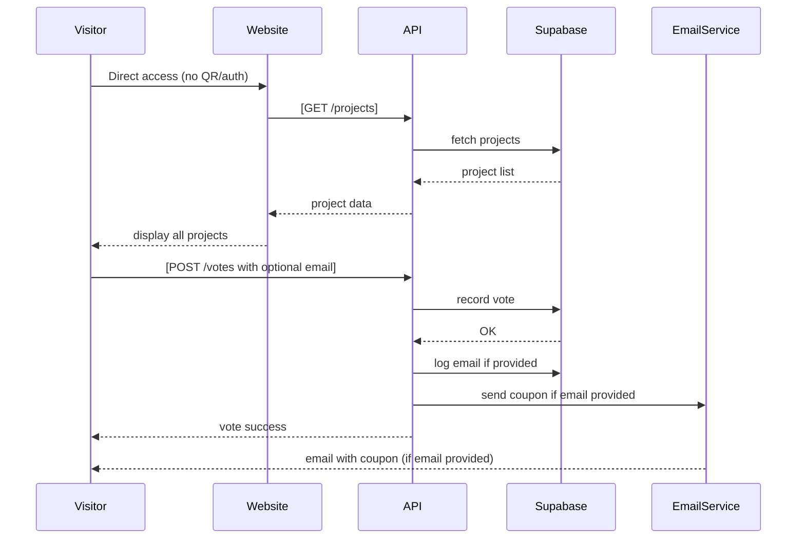
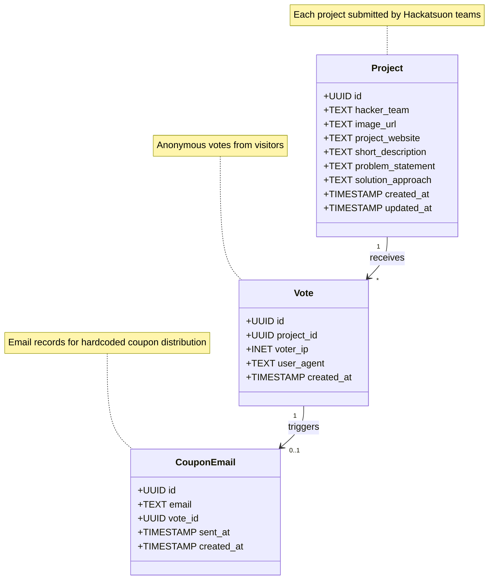

# Technical Spec

## 1. Background

### Problem Statement:
The Kesennuma Hackatsuon needs a streamlined voting platform for the public showcase where local residents, stakeholders, and visitors can easily vote on AI and Web3 projects addressing regional challenges. Currently, there's no simple way for the Kesennuma community to provide structured feedback on hackathon projects during the public reception at Pier 7, limiting meaningful engagement between developers and local citizens.

### Context / History:
Built for the Kesennuma Hackatsuon 2025, a two-week civic tech hackathon (October 5-17, 2025) focused on addressing local challenges like declining birthrate, aging population, and economic stagnation through AI and Web3 technologies.

The platform enables community-centered innovation by allowing direct feedback from local residents during the public showcase, celebrating Kesennuma's 350th anniversary of single-line fishing while fostering technological solutions.

Existing voting platforms exist, but few integrate open voting → live vote tally → email-based coupon issuance with burn mechanism in one flow, specifically designed for hackathon environments.

### Stakeholders:
- Hackatsuon participants (AI/Web3 developers, engineers, designers, researchers)
- Kesennuma local residents and community members
- Industry partners and judges
- Local government representatives
- Pier 7 public reception visitors (anonymous voters - no login required)
- Hackatsuon organizers and staff
- External systems (email service, Supabase backend, optional on-chain recording)

## 2. Motivation

### Goals & Success Stories:
- Hackatsuon teams can showcase their AI/Web3 solutions addressing Kesennuma's regional challenges.
- Local residents and visitors at Pier 7 can immediately vote on projects without barriers.
- Live voting results facilitate real-time community engagement during the public reception.
- Voters receive a thank-you coupon via email (single hardcoded coupon for MVP).
- Platform demonstrates successful civic tech collaboration between global developers and local community.
- Enables data-driven selection of projects for continued collaboration after the hackathon.
- Supports Kesennuma's mission of creating solutions with potential global applicability.

## 3. Scope and Approaches

### Non-Goals:
- Legally binding election system.
- High-traffic readiness (MVP assumes up to a few hundred users).
- Strict vote uniqueness enforcement (open voting allows multiple votes per visitor).
- User authentication or accounts.

### Reasoning for being off scope:
- Hackathon MVP—implementation cost and complexity must be minimized.
- Designed for a single live event, not nationwide deployment.

### Tradeoffs:
- Open voting: No authentication means potential for multiple votes (acceptable for MVP).
- Security: "good enough" for demo purposes, not banking-grade.
- Coupon distribution: Single hardcoded coupon sent to all emails (simplified for MVP).

### Value Proposition:
- Bridges the gap between global tech talent and Kesennuma's local community needs.
- Provides structured feedback mechanism during Pier 7 public reception.
- Enables data-driven selection of projects for continued development post-hackathon.
- Demonstrates Kesennuma's commitment to innovative civic tech solutions.
- Creates measurable community engagement for the city's 350th anniversary celebration.
- Serves as a model for other regional Japanese cities facing similar demographic challenges.

### Alternative Approaches:

| Technical Functionality | Pros | Cons |
|------------------------|------|------|
| Google Forms voting | Quick to set up | No live tally, poor UX |
| Fully on-chain voting | High transparency | Expensive, UX complexity |
| Hybrid MVP (our approach) | Simple UX, can optionally anchor results on-chain | Transparency is partial |

## 4. Step-by-Step Flow

### 4.1 Main ("Happy") Path

**Pre-condition:**
- Hackatsuon teams have submitted projects with all required fields.
- Voting website is publicly accessible.

**Flow:**
1. Visitor accesses the voting website directly (no QR code or authentication needed).
2. System displays all Hackatsuon projects with details.
3. Visitor selects a project → submits vote via `/votes`.
4. Vote is recorded in Supabase and aggregated.
5. System shows vote confirmation and optional email form.
6. If email provided, system sends the hardcoded coupon via email.
7. Visitor receives email with coupon information.

**Post-condition:**
- Vote recorded in database.
- Results visible on live dashboard.
- Coupon (if requested) sent and trackable.

### 4.2 Alternate / Error Paths

| # | Condition | System Action | Suggested Handling |
|---|-----------|---------------|-------------------|
| A1 | Invalid email format | Validation error | Show email format error |
| A2 | Network failure | Vote not saved | Retry option |
| A3 | Email delivery failure | Log error | Offer retry or contact support |
| A4 | Duplicate email submission | Send same coupon | Success message |

## 5. UML Diagrams



## 6. Data Model Overview

### Class Diagram



## 7. Supabase Database Schema

### Tables

#### `projects`
| Column | Type | Description |
|--------|------|-------------|
| id | UUID | Primary key |
| hacker_team | TEXT | Team name |
| image_url | TEXT | Project image URL |
| project_website | TEXT | Project website URL |
| short_description | TEXT | Brief project description (max 200 chars) |
| problem_statement | TEXT | What problem they're solving |
| solution_approach | TEXT | How they solve the problem |
| created_at | TIMESTAMP | Submission timestamp |
| updated_at | TIMESTAMP | Last update timestamp |

#### `votes`
| Column | Type | Description |
|--------|------|-------------|
| id | UUID | Primary key |
| project_id | UUID | Foreign key to projects |
| voter_ip | INET | IP address for tracking |
| user_agent | TEXT | Browser info |
| created_at | TIMESTAMP | Vote timestamp |

#### `coupon_emails`
| Column | Type | Description |
|--------|------|-------------|
| id | UUID | Primary key |
| email | TEXT | Recipient email (indexed) |
| vote_id | UUID | Associated vote (optional) |
| sent_at | TIMESTAMP | When email was sent |
| created_at | TIMESTAMP | Record creation timestamp |

### Indexes
- `coupon_emails.email` - For duplicate prevention
- `votes.project_id` - For aggregation queries
- `votes.created_at` - For time-based queries

### Row Level Security (RLS)
- `projects` - Read access for all, write for admins only
- `votes` - Insert for all, read for aggregates only
- `coupon_emails` - Insert via API only

## 8. Edge Cases and Concessions

- Vote submitted offline → not accepted; must retry online.
- Same email requesting multiple coupons → sends same hardcoded coupon (idempotent).
- Email delivery failures → logged for manual recovery if needed.
- Multiple votes → allowed since there's no authentication (by design).

## 9. API Endpoints

### Public Endpoints (No Auth Required)

#### GET `/api/projects`
Returns list of all projects with voting counts.

#### POST `/api/votes`
Body:
```json
{
  "project_id": "uuid",
  "email": "user@example.com", // optional - triggers coupon email
  "metadata": {} // optional
}
```
Records vote and optionally sends coupon email if email is provided.

#### GET `/api/metrics`
Returns real-time voting metrics for display on the metrics page.

### Admin Endpoints (Protected)

#### POST `/api/projects`
Create new project with all required fields.

#### GET `/api/analytics`
Detailed voting statistics and email distribution metrics.

## 10. Open Questions

- How to display projects in both Japanese and English for accessibility?

## 11. Metrics Page

### Purpose
Public-facing dashboard displaying real-time voting statistics for all Hackatsuon projects, providing transparency and encouraging participation.

### Display Components

#### 1. Overall Statistics
- Total votes cast
- Total number of participating projects


#### 2. Project Rankings
- Live leaderboard sorted by vote count
- Each project displays:
  - Project name and team
  - Vote count with percentage of total
  - Visual progress bar
  - Thumbnail image
  - Rank position with change indicator (↑↓)

#### 3. Voting Timeline
- Line chart showing vote accumulation over time
- Hourly/daily breakdown options
- Peak voting periods highlighted

#### 4. Project Comparison Grid
- Side-by-side comparison view
- Vote distribution pie chart
- Category-based filtering (if projects have categories)

### Technical Implementation
- Real-time updates via WebSocket or polling (30-second intervals)
- Responsive design for mobile viewing at Pier 7
- Bilingual support (Japanese/English toggle)
- No authentication required for viewing
- Cached data to reduce database load

### URL Structure
- `/metrics` - Main metrics dashboard
- `/metrics/project/:id` - Individual project metrics
- Updates automatically without page refresh

## 12. Implementation Notes

### Access Method
- Direct website access - no QR codes or tickets required
- Mobile-responsive design for easy voting on phones at Pier 7
- Simple URL that can be shared verbally or displayed on screens

### Coupon System
- Single hardcoded coupon code for all users (e.g., "HACKATSUON2025")
- Email template includes the coupon code and thank you message
- Email service integration via Resend or SendGrid
- Coupon for use at local Kesennuma businesses
- No validation or burning mechanism (simplified MVP)

### Email Validation
- Email-based: 1 coupon per email address per day
- Implemented via Supabase functions or middleware

### Project Display
- Projects shown in random order to avoid bias
- Live vote counts updated via websockets or polling
- Project images hosted on Supabase Storage or CDN
- Bilingual support (Japanese/English) for international participants

## 13. Glossary / References

- **Visitor** – Any person accessing the voting page (no auth required).
- **Coupon** – Hardcoded reward code sent via email as thank you for voting.
- **Project** – Hacker team submission with all required fields.
- **Coupon** – Unique code sent via email as reward for voting.

### Links:
- [Hackatsuon Official Website](https://www.hackatsuon.com/)
- Pier 7 venue information
- Kesennuma city resources
- AI/Web3 project submission guidelines